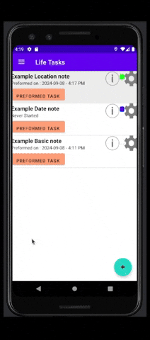

# LifeTasks
This Application allows you to keep track of actions that occur  
can set a remonder date, or location to remind you to take a note  
  
or to make a note every time at a specific date   
so you know what happened that day.  
  
this can also be like a diary with a reminder, aspect to not forget  
  
as well as to take a note when ever you go to a certain place.  
like to check your grocery list when you go grocery shoping  

## Demonstration
New Event 

 Perform Date Event 

 Perform Location Event 

 Perform normal Task 

 View Task Descriptions 

 Task Settings 

## Diagrams
Database Diagram  

## Built With
* Android Studio
* Gradle 
* Android Geo.Coder
* SQLiteDatabase

## Author
Project Coded by - Bailey Heck

## License
This project is licensed under the MIT License.

## Acknowledgments
Project idea - Brandon (Bailey) Heck

## History
This project was an Team assignment with an app with SQL Tables,  
I was in Data Engineering class while taking this android class  
and combined the knowlege to Complete the SQL Data Table.

## Key Programming Concepts Utilized
I have utilized SQL coding Techniques and android Application Systems. 
as well as used google geo locations  
to keep track of the location of the user, to their destination.

